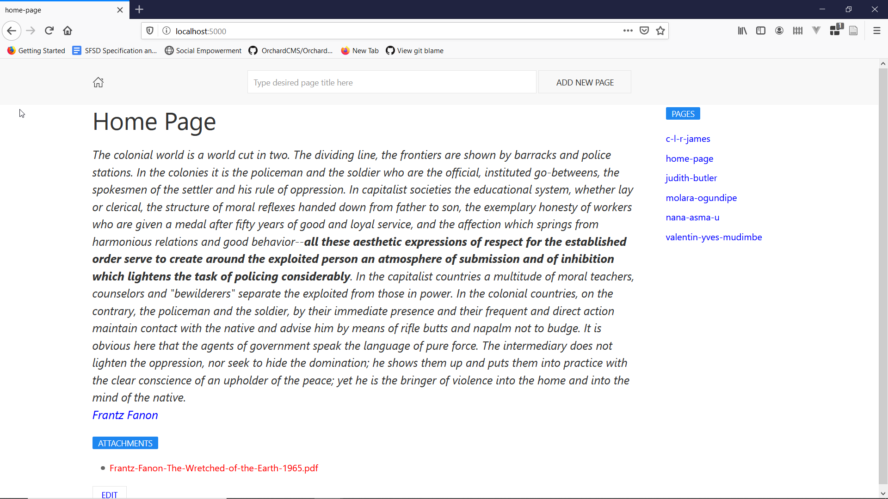

# Wiki

**Note**. This sample uses preview features of C# 9 that is only available on [.NET 5 SDK Preview 7](https://dotnet.microsoft.com/download/dotnet/5.0).

This is a Single File Application (SFA) that provide wiki functionality.

- It supports markdown
- You can rename pages
- It is stored using LiteDB
- It has a nice markdown editor
- You can upload attachments in every page
- You can delete attachments
- You can delete pages
- It has pages and attachment markdown linking helpers

All the code (864 lines) is contained within `Program.cs`. 

This SFA won't receive any further features because it will increase the lines of code and it will make it harder to read in one sitting. Additional development will be done at separate [repository](https://github.com/dodyg/fanon).

Please be noted that SFA is a very limited approach in web system development. It is really fun for quick hacking but as of now, there is a lot of nice functionality such as Model Binding that is not available for this style of development.

Used libraries:

* Storage - [LiteDB](https://github.com/mbdavid/LiteDB).
* Framework - [FeatherHttp](https://github.com/featherhttp/framework).
* Text Template - [Scriban](https://github.com/lunet-io/scriban).
* Markdown Support - [Markdig](https://github.com/lunet-io/markdig).
* Validation - [FluentValidation](https://github.com/FluentValidation/FluentValidation).
* Html Generation - [HtmlBuilders](https://github.com/amoerie/HtmlBuilders).
* Markdown Editor - [EasyMDE](https://github.com/Ionaru/easy-markdown-editor).
* Sanitizing Input - [HtmlSanitizer](https://github.com/mganss/HtmlSanitizer).

**Screenshot**
