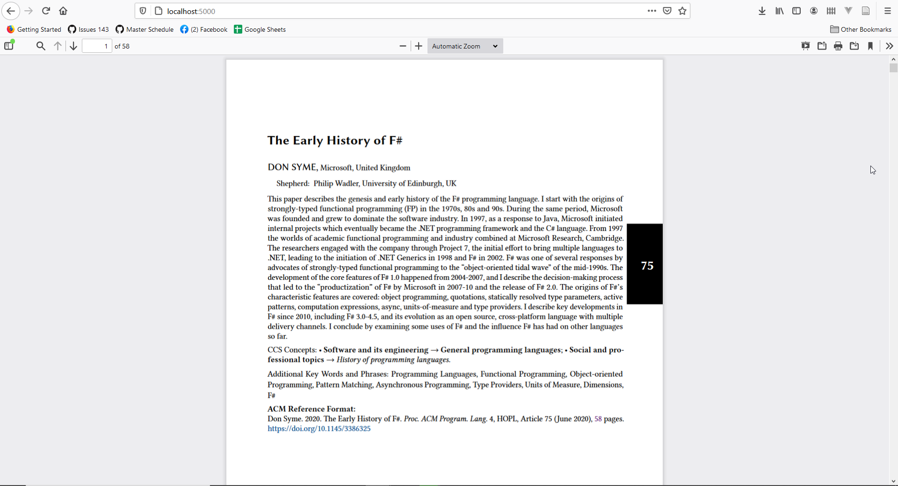

# Create a PDF Viewer using PDF.js

This sample shows you how to create a PDF Viewer using [PDF.js](https://mozilla.github.io/pdf.js/). The viewer code is based on their [sample code](https://github.com/mozilla/pdf.js/archive/gh-pages.zip) as outlined [here](https://github.com/mozilla/pdf.js/wiki/Frequently-Asked-Questions#gh-pages).

The sample PDF is [The early history of F#](https://dl.acm.org/doi/10.1145/3386325).

The ASP.NET Core code is a straightforward Razor Pages code.

