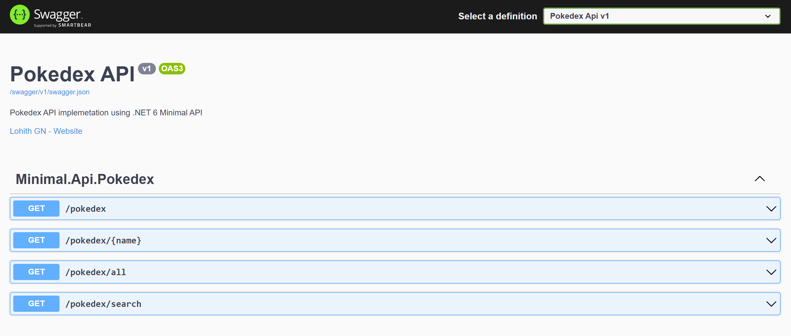

# Minimal Api - Pokedex 

This projet showcases the new .NET 6 Minimal APIs feature for developing Web APIs. We build a Pokedex API in this sample.

# Description

The project uses a static pokedex JSON file as a data store to read. The JSON file is kept in `Data` folder and read at runtime. We setup Swagger as part of the project and we get a Swagger UI to look at the endpoints supported. Steps to set up a minimal api:

- Changes to Program.cs
    - In program.cs, we add API explorer and Swagger.
        ```csharp
        builder.Services.AddEndpointsApiExplorer();
        builder.Services.AddSwaggerGen(options => options.SwaggerDoc("v1", new OpenApiInfo()
        {
            Description = "Pokedex API implemetation using .NET 6 Minimal API",
            Title = "Pokedex API",
            Version = "v1", 
            Contact = new OpenApiContact()
            {
                Name = "Lohith GN",
                Url = new Uri("https://github.com/lohithgn")
            }
        }));
        ```
    - Next, we add our required services to service collection.
        ```csharp
            services.AddScoped<IPokedexRepository, PokedexRepository>();
            services.AddScoped<IPokedexService, PokedexService>();
        ```
    - We then build the app
        ```csharp
            var app = builder.Build();
        ```
    - Once app is built, we configure services to use
        ```csharp
            app.UseStaticFiles();
            app.UseSwagger();
            app.UseSwaggerUI(c =>
            {
                c.SwaggerEndpoint("/swagger/v1/swagger.json", "Pokedex Api v1");
                c.RoutePrefix = string.Empty;
            });
        ```
    - We then add our Pokedex API routes
        ```csharp
             builder.MapGet("/pokedex", async (int? page, int? pageSize, IPokedexService service) =>
            {
                //...call to service
            })
            .Produces<PokedexPagedResponse>(StatusCodes.Status200OK);

            builder.MapGet("/pokedex/all", async (IPokedexService service) =>
            {
                //...call to service
            })
            .Produces<PokedexResponse>(StatusCodes.Status200OK);

            builder.MapGet("/pokedex/{name}", async (string name, IPokedexService service) =>
            {
                //...call to service
            })
            .Produces<PokemonEntity>(StatusCodes.Status200OK)
            .ProducesProblem(StatusCodes.Status404NotFound);

            builder.MapGet("/pokedex/search", async (string query, int? page, int? pageSize, IPokedexService service) =>
            {
                //...call to service
            })
            .Produces<PokedexPagedResponse>(StatusCodes.Status200OK)
            .Produces<PokedexPagedResponse>(StatusCodes.Status400BadRequest);

        ```
    - We then run the app
        ```csharp
            app.Run();
        ```        
- Run the app. Navigate to root of the site. Swagger UI will be rendered at the root of the site (we set Swagger route prefix to empty).


Note: To run this sample, you need to have .NET 6 installed on your machine. If you are using Visual Studio Code make sure to install the latest .NET 6 SDK. If you are using Visual Studio - make sure you use VS2022 as it comes with .NET 6.

# Credits

Contribution by [Lohith G. N.](https://github.com/lohithgn)
