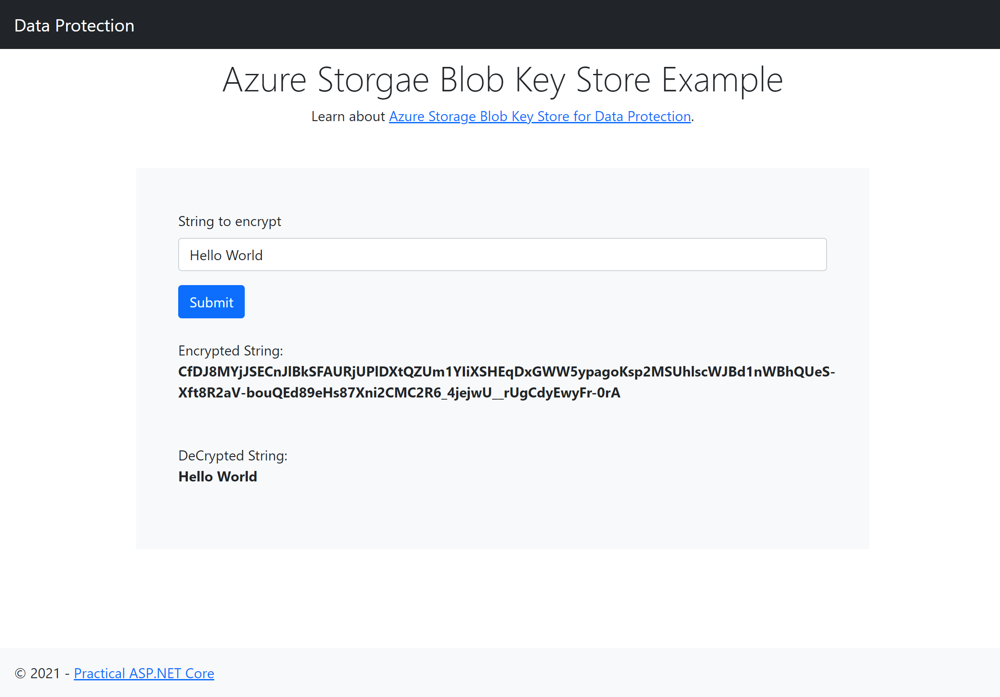

Azure Storage Blob Key Store
========

This sample showcases data protection with keys stored in Azure Blob Storage.

* Azure Storage connection string is set up in appsettings.
    ```
    "DataProtection": 
    {
        "StorageConnectionString": "<storage connection string>",
        "ContainerName": "<container name>",
        "BlobName": "<blob name e.g. dpkeys.xml>"
    }
    ```
* Key persistence is set up in StartUp ConfigureServices().
    ```
    public void ConfigureServices(IServiceCollection services)
        {
            var storageConnectionString = Configuration["DataProtection:StorageConnectionString"];
            var containerName = Configuration["DataProtection:ContainerName"];
            var blobName = Configuration["DataProtection:BlobName"];
            services.AddDataProtection()
                    .PersistKeysToAzureBlobStorage(storageConnectionString,containerName,blobName);
            ...
        }
    ```

## Reference
[Data Protection Key Persistenc using Azure Storage Blob](https://github.com/Azure/azure-sdk-for-net/blob/Azure.Extensions.AspNetCore.DataProtection.Blobs_1.2.1/sdk/extensions/Azure.Extensions.AspNetCore.DataProtection.Blobs/README.md)

## Screenshot


## Credits
[Lohith GN](https://github.com/lohithgn)