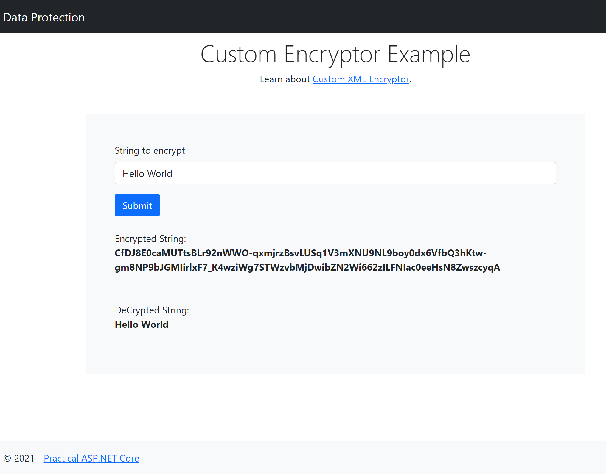

Custom XML Encryptor
========

This sample showcases data protection with keys encrypted using custom XML encryptor.

* Package `Microsoft.AspNetCore.DataProtection` is added to the project.

* Custom XML Encryptor class is created
    ```
    public class CustomXmlEncryptor : IXmlEncryptor
    {
        private readonly ILogger _logger;

        public CustomXmlEncryptor(IServiceProvider services)
        {
            _logger = services.GetRequiredService<ILoggerFactory>().CreateLogger<CustomXmlEncryptor>();
        }

        public EncryptedXmlInfo Encrypt(XElement plaintextElement)
        {
            if (plaintextElement == null)
            {
                throw new ArgumentNullException(nameof(plaintextElement));
            }

            _logger.LogInformation("Not encrypting key");

            var newElement = new XElement("unencryptedKey",
                new XComment(" This key is not encrypted. "),
                new XElement(plaintextElement));
            var encryptedTextElement = new EncryptedXmlInfo(newElement, typeof(CustomXmlDecryptor));

            return encryptedTextElement;
        }
    }
    ```
* Custom XML decryptor class is created
    ```
    public class CustomXmlDecryptor : IXmlDecryptor
    {
        private readonly ILogger _logger;

        public CustomXmlDecryptor(IServiceProvider services)
        {
            _logger = services.GetRequiredService<ILoggerFactory>().CreateLogger<CustomXmlDecryptor>();
        }

        public XElement Decrypt(XElement encryptedElement)
        {
            if (encryptedElement == null)
            {
                throw new ArgumentNullException(nameof(encryptedElement));
            }

            return new XElement(encryptedElement.Elements().Single());
        }
    }
    ```

* Helper extension method is created to add custom XML encryptor to data protection builder.
    ```
    public static IDataProtectionBuilder UseXmlEncryptor(
            this IDataProtectionBuilder builder,
            Func<IServiceProvider, IXmlEncryptor> factory)
        {
            builder.Services.AddSingleton<IConfigureOptions<KeyManagementOptions>>(serviceProvider =>
            {
                var instance = factory(serviceProvider);
                return new ConfigureOptions<KeyManagementOptions>(options =>
                {
                    options.XmlEncryptor = instance;
                });
            });

            return builder;
        }
    ```

* Key persistence & protection is set up in StartUp ConfigureServices().
    ```
    public void ConfigureServices(IServiceCollection services)
        {
            ...
            var keysFolder = Path.Combine(Directory.GetCurrentDirectory(), "temp-keys");
            services.AddDataProtection()
                    .PersistKeysToFileSystem(new DirectoryInfo(keysFolder))
                    .UseXmlEncryptor(s => new CustomXmlEncryptor(s));
            ...
        }
    ```
    Note: In this demo, Keys are stored on disk in a temp folder. Not advisable for production scenario.

## Reference
[Data Protection using custom XML encryptor](https://docs.microsoft.com/en-us/aspnet/core/security/data-protection/extensibility/key-management?view=aspnetcore-5.0#ixmlencryptor)

## Screenshot


## Credits
[Lohith GN](https://github.com/lohithgn)