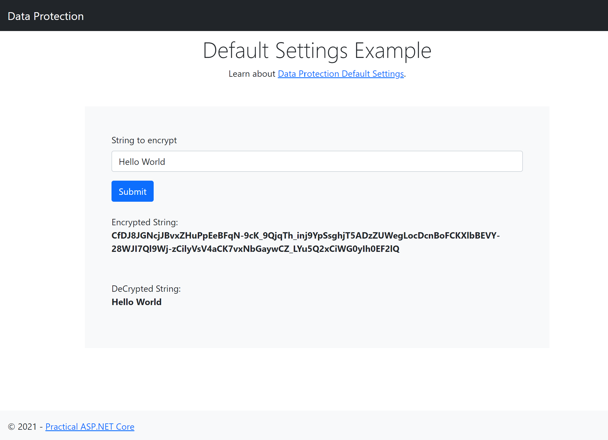

Data Protection with Default Settings
========

This sample showcases data protection with default settings.

* Data Protection default settings are set in Startup ConfigureServices() method.
    ```
    public void ConfigureServices(IServiceCollection services)
    {
        services.AddDataProtection();
        ...
    }
    ```


## Reference
[Data Protection with Default Settings](https://docs.microsoft.com/en-us/aspnet/core/security/data-protection/configuration/default-settings?view=aspnetcore-5.0)


## Screenshot



## Credits
[Lohith GN](https://github.com/lohithgn)