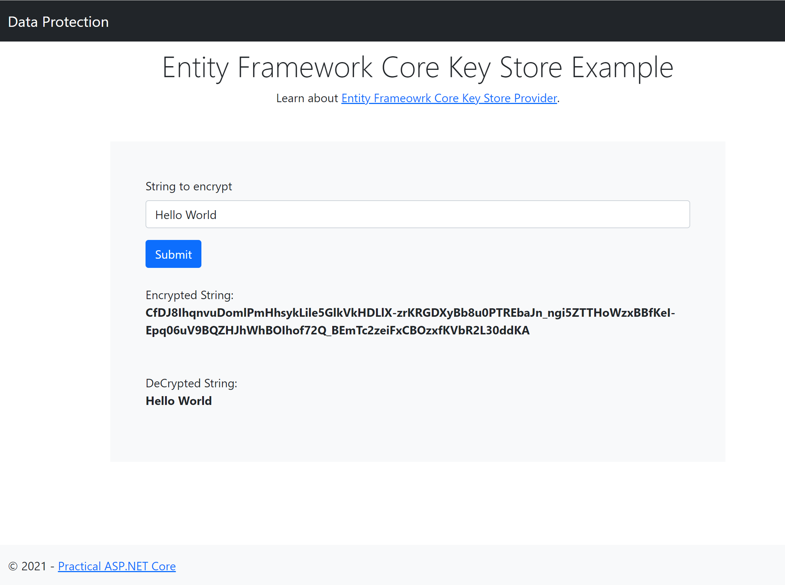

Entity Framework Core Key Store
========

This sample showcases data protection with keys stored in relational database using Entity Framework Core.

* Package `Microsoft.AspNetCore.DataProtection.EntityFrameworkCore` is added to the project.

* Database connection string is set up in appsettings.
    ```
    "DataProtection": 
    {
        ...
        "DefaultConnection": "<database connection string>",
        ...
    }
    ```

* Data protection EF core database context is set up as below:
    ```
    class DataProtectionKeyContext : DbContext, IDataProtectionKeyContext
    {
        public DataProtectionKeyContext(DbContextOptions<DataProtectionKeyContext> options)
            : base(options){ }

        public DbSet<DataProtectionKey> DataProtectionKeys { get; set; }
    }
    ```

* EF Core data migration is setup using below commands:
    ```
    dotnet ef migrations add AddDataProtectionKeys --context DataProtectionKeyContext
    dotnet ef database update --context DataProtectionKeyContext
    ```

* Key persistence is set up in StartUp ConfigureServices().
    ```
    public void ConfigureServices(IServiceCollection services)
        {
            ...
            var storageConnectionString = Configuration["DataProtection:DefaultConnection"];

            // Add a DbContext to store your data protection Keys
            services.AddDbContext<DataProtectionKeyContext>(options =>
                options.UseSqlServer(storageConnectionString));

            // Key persistence
            services.AddDataProtection()
                .PersistKeysToDbContext<DataProtectionKeyContext>();
            ...
        }
    ```

## Reference
[Data Protection Key Persistence using EF Core](https://docs.microsoft.com/en-us/aspnet/core/security/data-protection/implementation/key-storage-providers?view=aspnetcore-5.0&tabs=netcore-cli#entity-framework-core)

## Screenshot


## Credits
[Lohith GN](https://github.com/lohithgn)