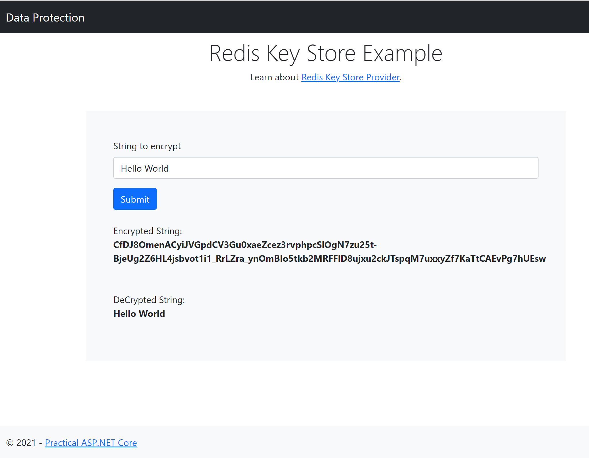

Redis Key Store
========

This sample showcases data protection with keys stored in Redis.

* Package `Microsoft.AspNetCore.DataProtection.StackExchangeRedis` is added to the project.

* Redis configuration is set up in appsettings.
    ```
    "DataProtection": 
    {
        ...
        "RedisServer": "<your redis server>",
        "RedisPassword": "<your redis password>",
        "RedisKey": "dp-keys"
        ...
    }
    ```

* Key persistence is set up in StartUp ConfigureServices().
    ```
    public void ConfigureServices(IServiceCollection services)
        {
            ...
            var redisServer = Configuration["DataProtection:RedisServer"];
            var redisPassword = Configuration["DataProtection:RedisPassword"];
            var redisKey = Configuration["DataProtection:RedisKey"];
            var redis = ConnectionMultiplexer.Connect($"{redisServer},password={redisPassword}");
            services.AddDataProtection()
                .PersistKeysToStackExchangeRedis(redis,redisKey);
            ...
        }
    ```

## Reference
[Data Protection Key Persistence using Redis](https://docs.microsoft.com/en-us/aspnet/core/security/data-protection/implementation/key-storage-providers?view=aspnetcore-5.0&tabs=visual-studio#redis)

## Screenshot


## Credits
[Lohith GN](https://github.com/lohithgn)

dotnet6