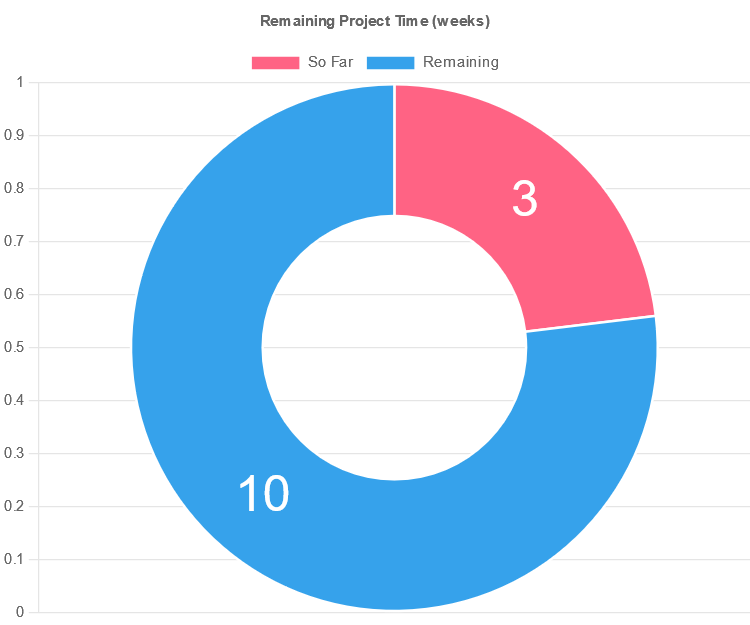

# Remaining Time

This is a simple program to visual the remaining weeks in a project. Everything is written in a single `program.cs` file.

It uses the following JavaScript components:

* [chart.js](https://www.chartjs.org/)
* [chartjs-plugin-datalables](https://chartjs-plugin-datalabels.netlify.app/guide/labels.html#multiple-labels)

**Screenshot**
