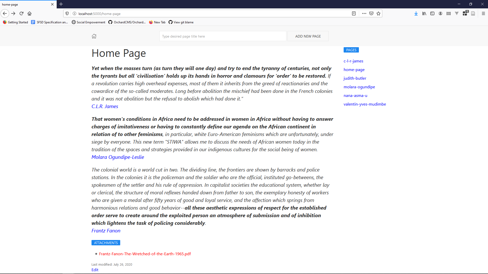

# Wiki

This is a Single File Application (SFA) that provide wiki functionality.

- It supports markdown
- You can rename pages
- It is stored using LiteDB
- It has a nice markdown editor
- You can upload attachments in every page
- You can delete attachments
- You can delete pages
- It has pages and attachment markdown linking helpers

All the code (810 lines) is contained within `Program.cs`. 

Used libraries:

* Storage - [LiteDB](https://github.com/mbdavid/LiteDB).
* Text Template - [Scriban](https://github.com/lunet-io/scriban).
* Markdown Support - [Markdig](https://github.com/lunet-io/markdig).
* Validation - [FluentValidation](https://github.com/FluentValidation/FluentValidation).
* Html Generation - [HtmlBuilders](https://github.com/amoerie/HtmlBuilders).
* Markdown Editor - [EasyMDE](https://github.com/Ionaru/easy-markdown-editor).
* Sanitizing Input - [HtmlSanitizer](https://github.com/mganss/HtmlSanitizer).

**Screenshot**

dotnet6