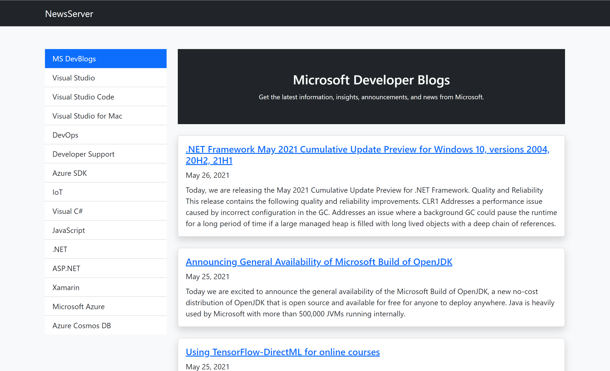

# NewsServer Demo

**About:**

This sample showcases creating a RSS reader using ASP.NET Core MVC.

- Feeds to be read are configured in appsettings.json as below:
  
  ```
  "NewsServer": {
      "Feeds": [
        {
          "Name": "MS DevBlogs",
          "Url": "https://devblogs.microsoft.com/landingpage/"
        },
        ...
      ]
  }
  ```
- Feed is read using ```Microsoft.ServiceModel.Syndication``` library
  
  ```
  using var reader = XmlReader.Create(feedUrl, new XmlReaderSettings { Async = true });
  var feed = SyndicationFeed.Load(reader);
  ```

**Screenshot:**




**Credits**:

[Lohith GN](https://github.com/lohithgn)