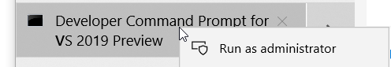
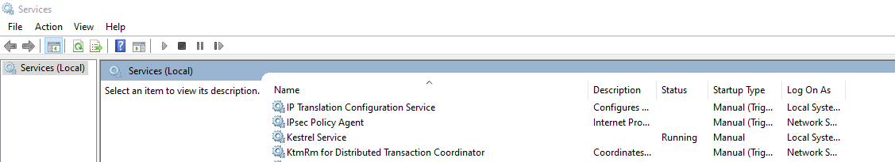

# Hosting Kestrel from Windows Service

This sample shows how to create a Windows Service that runs a Kestrel server. Further documentation is [here](https://docs.microsoft.com/en-us/aspnet/core/host-and-deploy/windows-service?view=aspnetcore-6.0&tabs=visual-studio).

This sample requires dependency from [Microsoft.Extensions.Hosting.WindowsServices](https://www.nuget.org/packages/Microsoft.Extensions.Hosting.WindowsServices).

## How to install the windows service

Run Visual Studio Command Line under administrator mode.

Run the following command `sc create "{Fill Service Name} binpath="{Full path to your Windows Service EXE}"`

Open Windows Services Manager and start the service.

or you can execute this command `sc start "{Fill Service Name}"` to start the service from the VS Command Line.

To stop the service, execute this command `sc stop "{Fill Service Name}"`.

## How to remove the windows service.

Run Visual Studio Command Line under administrator mode.

Run the following command `sc delete "{Fill Service Name}"`.

dotnet6